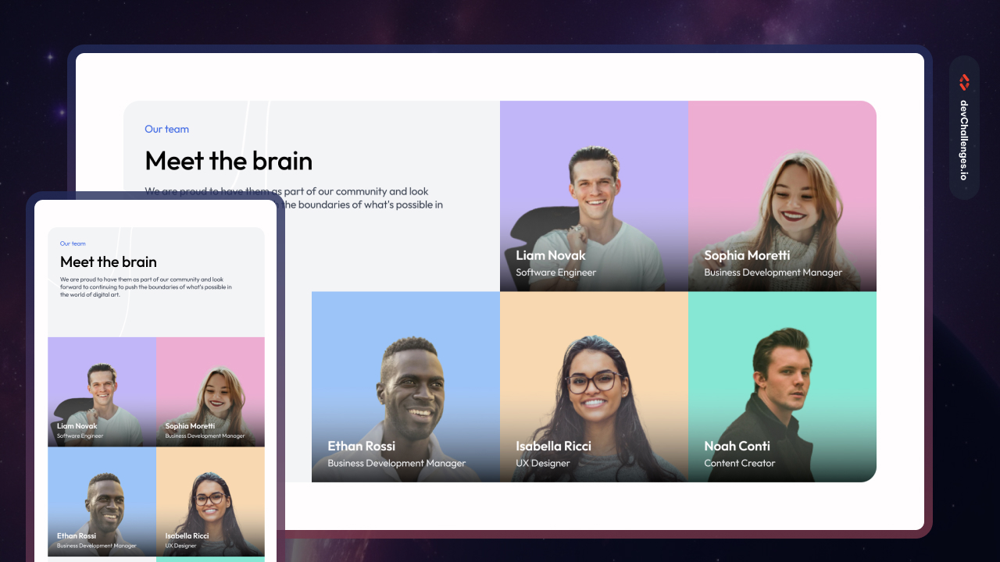

<h1 align="center">Meet the Team Section</h1>

<div align="center">
   Solution for a challenge from  <a href="http://devchallenges.io" target="_blank">Devchallenges.io</a>.
</div>

<div align="center">
  <h3>
    <a href="[INSERT YOUR LIVE DEMO LINK HERE]">
      Demo
    </a>
    <span> | </span>
    <a href="[INSERT YOUR SOLUTION REPO LINK HERE]">
      Solution
    </a>
    <span> | </span>
    <a href="https://devchallenges.io/challenges/hhmesIS3p39ebuXFH7aa">
      Challenge
    </a>
  </h3>
</div>

## Overview



This is my responsive solution for the Meet the Team Section challenge. The goal was to create a clean, professional grid layout to display team member profiles, ensuring the design adapts fluidly from mobile to desktop screens.

### Built With

-   HTML5 (Semantic Markup)
-   CSS3 (CSS Grid & Flexbox)
-   Responsive Design (Mobile-first workflow)

## Features

-   **Responsive Grid:** Uses CSS Grid (or Flexbox) to arrange team member cards into a single column on mobile and a multi-column grid on larger screens.
-   **Semantic HTML:** properly structured content using `<section>`, `<figure>`, and heading tags.
-   **Visual Accuracy:** Matches the spacing, typography, and image alignment of the provided design.

## How to Run Locally

To run this project on your local machine:

1.  Clone the repository:
    ```bash
    git clone [https://github.com/](https://github.com/)[YOUR-USERNAME]/[REPO-NAME].git
    ```
2.  Navigate to the project directory.
3.  Open `index.html` in your browser.

## Contact

-   GitHub: [@your-username](https://github.com/your-username)
-   DevChallenges: [@your-username](https://devchallenges.io/portfolio/your-username)